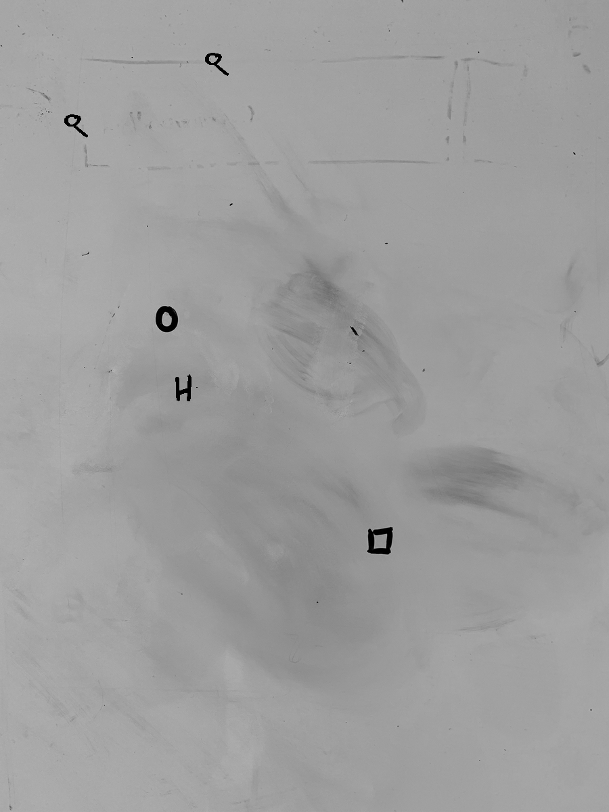

# Mask R-CNN for Object Detection and Segmentation

Based on the implementation of [Mask R-CNN](https://arxiv.org/abs/1703.06870) on Python 3, Keras, and TensorFlow, one shot object recognition was developed. The model generates bounding boxes and segmentation masks for each instance of an object in the image. It's based on Feature Pyramid Network (FPN) and a ResNet101 backbone.



The repository includes:
* Source code of Mask R-CNN built on FPN and ResNet101.
* Training code for MS COCO
* Pre-trained weights for MS COCO
* Jupyter notebooks to visualize the detection pipeline at every step
* Example of training on wireframes


The base code, provided by [Matterport3D](https://matterport.com/blog/2017/09/20/announcing-matterport3d-research-dataset/), is documented and designed to be easy to extend. 

# Getting Started
* [Data_Preprocessing.ipynb](samples/wireframe/Data_Preprocessing.ipynb) - use it to train the weights for the model.

* [train_icons_data.ipynb](samples/wireframe/train_icons_data.ipynb) - use it to process the icons and format them in the write way to generate images with wireframes.street.png

* [One-Shot.py](samples/wireframe/One-Shot.ipynb) - it comprises the main code for the one shot object recognition, making the overall Mask R-CNN more computationally efficient.  

## Installation
1. Clone this repository
2. Install dependencies
   ```bash
   pip3 install -r requirements.txt
   ```
3. Run setup from the repository root directory
    ```bash
    python3 setup.py install
    ``` 

# Projects Using this Model
If you extend this model to other datasets or build projects that use it, we'd love to hear from you.
