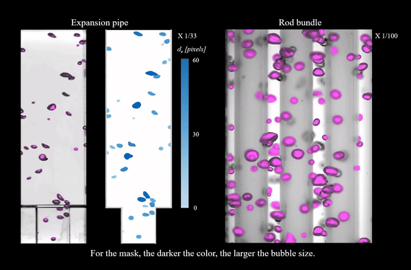

# Mask R-CNN for Bubble mask extraction

happy day!

This is a project of [Multiphase flow & Flow visualization Lab](https://mffv.snu.ac.kr/) for bubble detection and mask extraction. The purpose of the project is to automatically extract bubble mask of experimental images from various experimental conditions using deep learning model. More information can be found in the paper (to be updated :thinking:). 

The codes are based on [Matterport Mask R-CNN implementation](https://github.com/matterport/Mask_RCNN), using ResNet-101 as the backbone and applied transfer learning from pre-trained COCO weights. 

The output of the model is as follows:

- color mask for input image/video 
- logical mask for each bubble detected
- bubble information list (centroid, area, axes) (to be updated :thinking:)
- logical mask for one input image (for tracditional PIV or PTV application) (to be updated :thinking:)

The repository includes:

- Source code of Mask R-CNN built on FPN and ResNet101.
- Source code to visualize the color mask of the input image/video.
- Jupyter notebook to get the output.




## Tested environment
This code was tested on the below environment.

- NVIDIA RTX 2080 ti
- Driver 440.95.01
- CUDA 10.2
- cuDNN 7.6.5
- Python 3.7
- TensorFlow 1.14.0
- Keras 2.2.5 and other common packages listed in `requirements.txt`.


## Preparing the input
Prepare 3-channel jpg for testing (same for the video).


## How to test your own bubble image/video
1. Clone this repository
1. Install dependencies
   ```bash
   pip3 install -r requirements.txt
   ```
1. Run setup from the repository root directory
    ```bash
    python3 setup.py install
    ``` 
1. Download trained weights (mask_rcnn_bubble.h5) from the [link](https://drive.google.com/file/d/1BSi4djQtR0QKYEp-nFGsGi0e6UVEx5ug/view?usp=sharing).

1. Run bubble detection script **in `bubble/` directory** to visualize color mask
    ```bash
    bubble$ python3 bubble.py splash --weights=path/to/mask_rcnn_bubble.h5 --image=path/to/image
    ```
    for the video:
    ```bash
    bubble$ python3 bubble.py splash --weights=path/to/mask_rcnn_bubble.h5 --video=path/to/video
    ```
