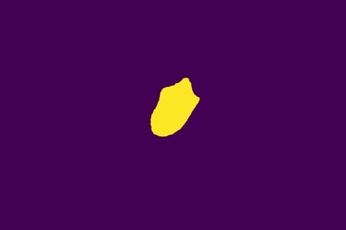
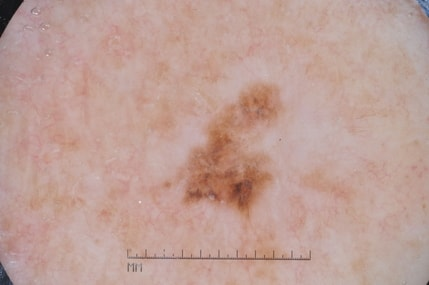
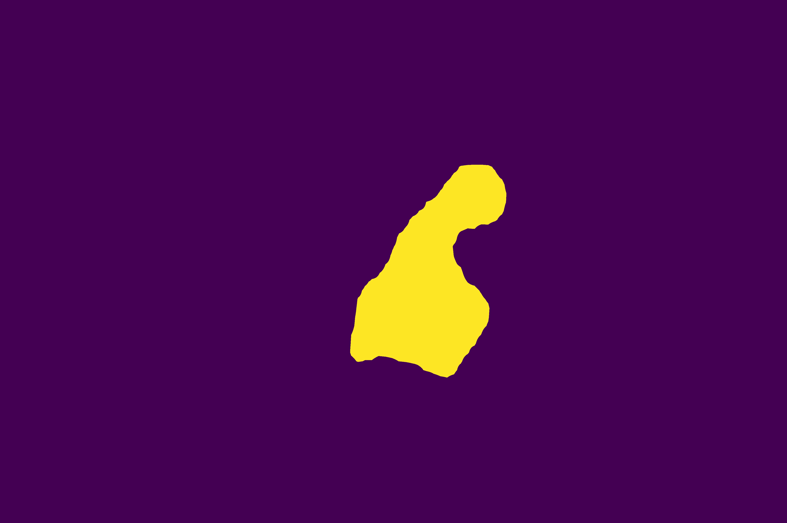
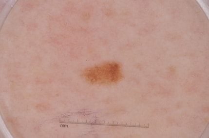
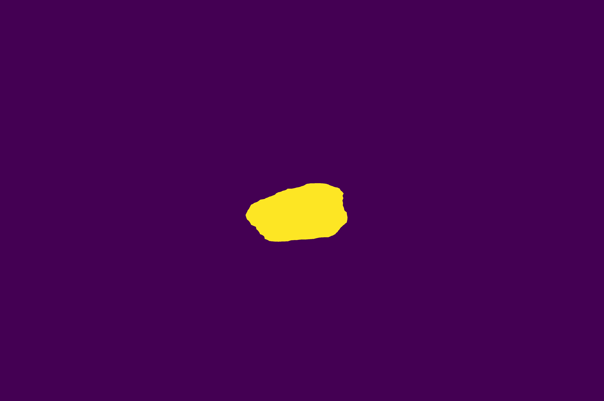

# Mask R-CNN for Melanoma Detection and Segmentation

This implementation of Mask_RCNN has been trained on Melanoma Images obtained from [ISIC](https://www.isic-archive.com)

This repository has been forked from [matterport/Mask_RCNN](https://github.com/matterport/Mask_RCNN)

The code for training and loading the images and it's respective masks are stored in the [melanoma](melanoma/) folder

The images on the left are melanoma images, the images on the right are their respective masks

			

			

			

