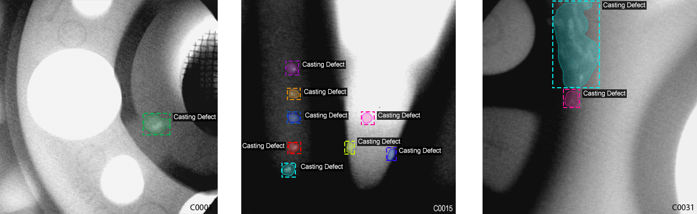
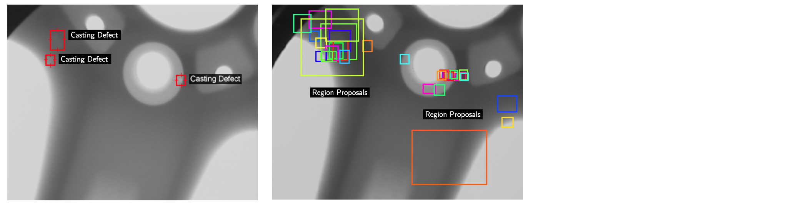
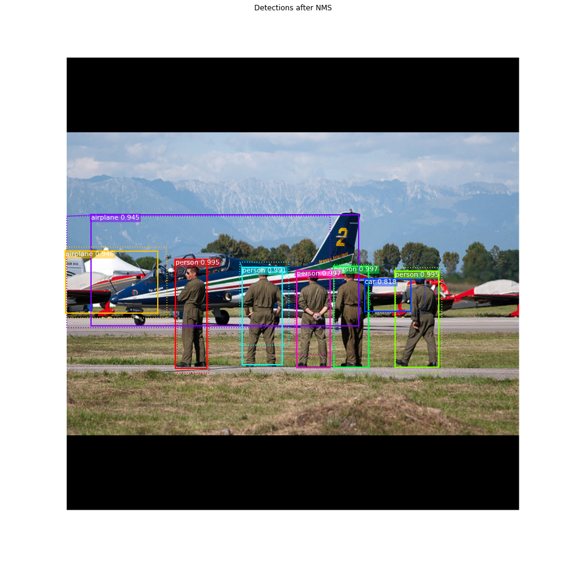
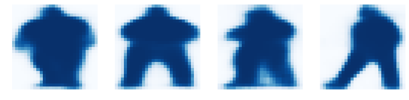
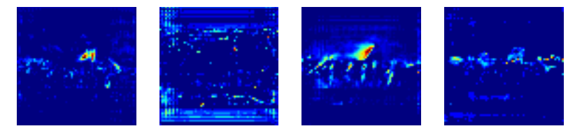
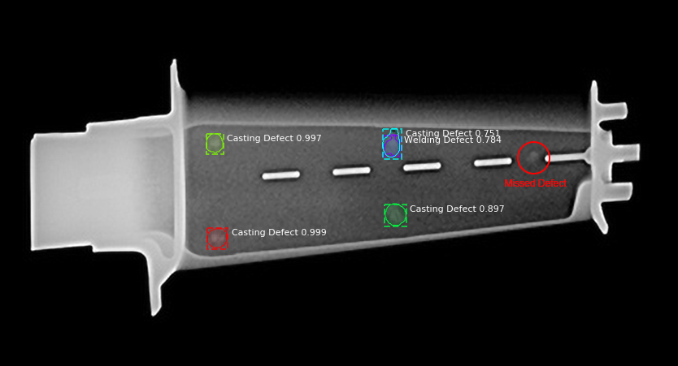

# Detection and Segmentation of Manufacturing Defects using X-Ray Images

This project uses the  [Mask R-CNN](https://arxiv.org/abs/1703.06870) framework to automatically detect casting defects in X-Ray images.
The defect detection system is trained and tested on the [GDXray dataset](dmery.ing.puc.cl/index.php/material/gdxray/). For more details, read our paper:

M. Ferguson, R. Ak, S. Jeong and K. H. Law, "[Detection and Segmentation of Manufacturing Defects with Convolutional Neural Networks and Transfer Learning](https://arxiv.org/pdf/1808.02518.pdf)", Smart and Sustainable Manufacturing Systems. 2018.




# Getting Started
Start by cloning this dataset and downloading the GDXray dataset.
## Training on GDXray Casting Set

```sh
# Python 3.6
python gdxray.py \
--dataset=~/data/GDXray \
--subset=Castings \
--model=mask_rcnn_coco.h5 \
--logs=logs/gdxray \
--download=True
```

## Evaluating on GDXray Casting Set

```sh
# Python 3.6
python gdxray.py \
--evaluate=True \
--dataset=~/data/GDXray \
--subset=Castings \
--logs=logs/gdxray
```

## Inspecting the Model
The iPython notebooks are a great way of inspecting the model results:

* [inspect_data.ipynb](/inspect_data.ipynb). This notebook visualizes the different pre-processing steps
to prepare the training data.

* [inspect_model.ipynb](/inspect_model.ipynb) This notebook goes in depth into the steps performed to detect and segment objects. It provides visualizations of every step of the pipeline.

* [inspect_weights.ipynb](/inspect_weights.ipynb)
This notebooks inspects the weights of a trained model and looks for anomalies and odd patterns.

Run the notebook like this:
```sh
jupyter notebook inspect_model.ipynb
```

# Step by Step Detection
To help with debugging and understanding the model, there are 3 notebooks 
([inspect_data.ipynb](inspect_data.ipynb), [inspect_model.ipynb](inspect_model.ipynb),
[inspect_weights.ipynb](inspect_weights.ipynb)) that provide a lot of visualizations and allow running the model step by step to inspect the output at each point. Here are a few examples:

## 1. Anchor sorting and filtering
Visualizes every step of the first stage Region Proposal Network and displays positive and negative anchors along with anchor box refinement.


## 2. Bounding Box Refinement
This is an example of final detection boxes (dotted lines) and the refinement applied to them (solid lines) in the second stage.


## 3. Mask Generation
Examples of generated masks. These then get scaled and placed on the image in the right location.



## 4.Layer activations
Often it's useful to inspect the activations at different layers to look for signs of trouble (all zeros or random noise).



## Differences from the Official Paper
This implementation follows the Mask RCNN paper for the most part, but there are a few cases where we deviated in favor of code simplicity and generalization. These are some of the differences we're aware of. If you encounter other differences, please do let us know.

* **Image Resizing:** To support training multiple images per batch we resize all images to the same size. We preserve the aspect ratio, so if an image is not square we pad it with zeros. In the paper the resizing is done such that the longest side is 768px.

* **Bounding Boxes**: Some datasets provide bounding boxes and some provide masks only. To support training on multiple datasets we opted to ignore the bounding boxes that come with the dataset and generate them on the fly instead. We pick the smallest box that encapsulates all the pixels of the mask as the bounding box. This simplifies the implementation and also makes it easy to apply certain image augmentations that would otherwise be really hard to apply to bounding boxes, such as image rotation.

    To validate this approach, we compared our computed bounding boxes to those provided by the COCO dataset.
We found that ~2% of bounding boxes differed by 1px or more, ~0.05% differed by 5px or more, 
and only 0.01% differed by 10px or more.

* **Learning Rate:** The paper uses a learning rate of 0.02, but we found that to be
too high, and often causes the weights to explode, especially when using a small batch
size. It might be related to differences between how Caffe and TensorFlow compute 
gradients (sum vs mean across batches and GPUs). Or, maybe the official model uses gradient
clipping to avoid this issue. We do use gradient clipping, but don't set it too aggressively.
We found that smaller learning rates converge faster anyway so we go with that.

* **Anchor Strides:** The lowest level of the pyramid has a stride of 4px relative to the image, so anchors are created at every 4 pixel intervals. To reduce computation and memory load we adopt an anchor stride of 2, which cuts the number of anchors by 4 and doesn't have a significant effect on accuracy.

## Requirements
* Python 3.6+
* TensorFlow 1.6+
* Keras 2.0.8+
* Jupyter Notebook
* Numpy, skimage, scipy, Pillow, cython, h5py

## More examples
Detection of casting defects in a jet engine blade:


Segmentation of defects in a manufacturing weld:


## Contributors
* Max Ferguson: [@maxkferg](https://github.com/maxkferg)
* Stanford Engineering Informatics Group: [eil.stanford.edu](http://eil.stanford.edu/index.html)