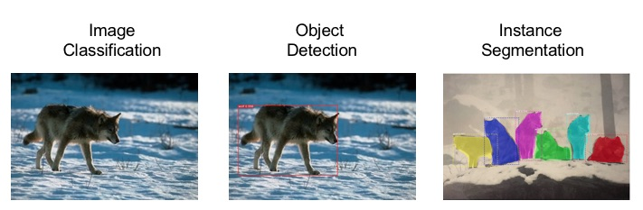
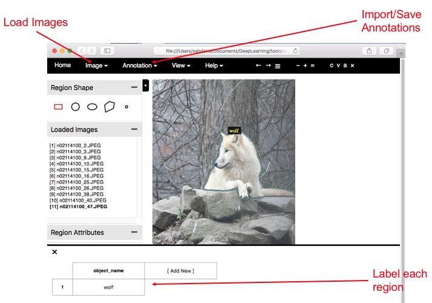
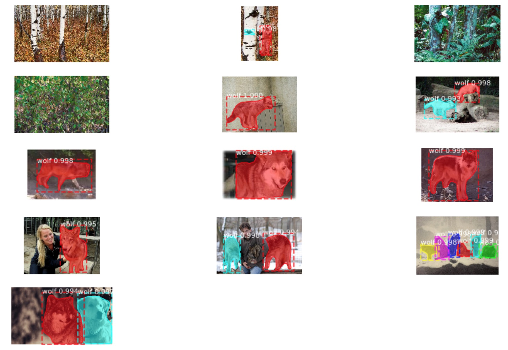
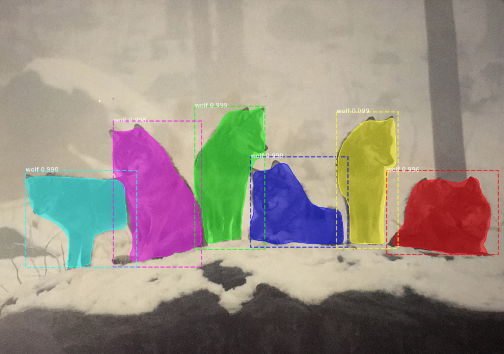
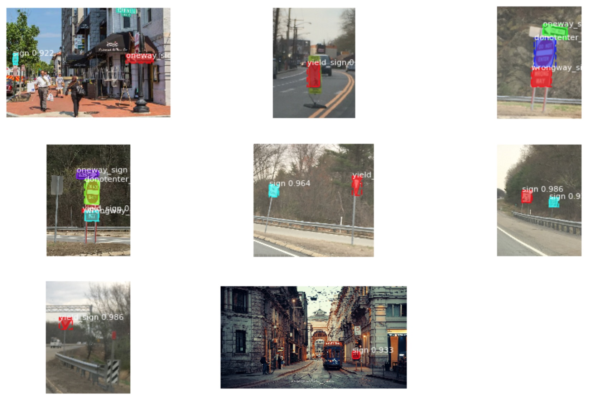

## Overview

This was done for a CSCI E89 class project that demonstrates single and multi-class instance segmentation using Mask R-CNN.  was choosen since it used Keras/Tensorflow, pulled together various network architectures (Faster R-CNN, FPN, Mask R-CNN), and is well writtent and documented.

This project leverage data from ImageNet (wolves, signs) as well as my own photos to train and test. The data was annotated using VGG Iamge Annotator.

Classification is concerned with identifying a single object in an image. Classification along with localization identifies a sign object and also places a bounding box around it. The goal of object detection is classify multiple objects and localize each using bounding boxes. Instance segmentation looks to classify multiple objects and their pixels. The below images help to illustrate the distinction. 

* Object classification - The identification of an object in a photo.
* Object detection -  Identification of one or more objects and their location. Specified with a bounding box.
* Instance segmentation - Detection of one or more objects of different classes, labeling each pixel with a category label. A Segment mask is generated for each instance.



## Installation 

Follow the installation instruction here: https://github.com/sabderra/Mask_RCNN

Additional installation steps:

```bash
pip install git+https://github.com/aleju/imgaug
```

## Image Annotation

The VGG Image Annotator (VIA) was used to annotate the images. VIA was selected because it was simple to install on any OS (single html page),  simple to use, and responsive. Other options include  COCO Annotation UI (https://github.com/tylin/coco-ui.git) and LabelMe  (
http://labelme2.csail.mit.edu/).



Launch via from a web browser or command line. 

1.	Click on Load images, a file browser will appear, navigate to your images and select the images you want to start annotating.
2.	If you have existing annotations corresponding with this image set, click on Annotation->Import to bring them into the view.
3.	Select a Region Shape from the upper left and begin outlining the image.
4.	If this is the first image expand Region Attributes, in the bottom pane, click Add New and create an entry for "object_name". Unsurprisingly, the label "wolf" is used for wolf images. 


VIA exports annotations in both csv and json. Json was used. The format is straight forward:

```
{
    "n02114100_10.JPEG81442": {
        "fileref": "",
        "size": 81442,
        "filename": "n02114100_10.JPEG",
        "base64_img_data": "",
        "file_attributes": {},
        "regions": {
            "0": {
                "shape_attributes": {
                    "name": "polygon",
                    "all_points_x": [ ... ],
                    "all_points_y": [ ... ]
                },
                "region_attributes": {
                    "object_name": "wolf"
                }
            }
        }
    },
    "n02114100_120.JPEG174337": {
        ...
    },
    "n02114100_123.JPEG4410": {
        ...
    },
    ...
```

The key attributes are:
* filename is the location of the image on disk
* all_points_x and all_points_y define the polygons for the masks and deriving the bounding boxes. 
* object_name was used to label the specific polygon. This needs to be mapped to the class index.
* Note, shape of the image is missing and not written by via v1.0.5. To compensate, you use via_prep.py to add that height and width.


## Single Class Instance Segmentation
Following was based on 

Some differences with the ballon example are:
1. Rather then having separate directories for traning and validation, a single directory containing all images and annoatations is used. Scripts found in det.py will create separate training and validation training set objects. The default split is 80/20 respectively.
2. via_util.py contains conviennce functions for merging multiple annotations files.
3. via_prep.py is used to prepare the annotations by adding the height and width of the image and validating the polygon.

Dataset uses wolf images downloaded through ImageNet. The images came in a variety of sizes and quality and were all RGB. 
The batch consistent of variety of wolf species. 
* Out of 1391 images only 171 images were annotated.
* The total size of this data was 15M.

Sample results are:



## Multi Class Instance Segmentation
This builds on the previous, but trains on mulitple different traffic signs. det.py is used for configuration creating the datasets.

For multi-class traffic signs were used. Images were downloaded from ImageNet and some taken locally using an iPhone.
* Used to train the network to detect multiple traffic signs. 
* This batch consisted of 85 annotated images
* Total size was  26M




## References
1.	K. He, G. Gkioxari, P. Dollár, R. Girshick, "Mask R-CNN", https://arxiv.org/pdf/1703.06870 
2.	Mask R-CNN Implementation https://github.com/matterport/Mask_RCNN
3.	R. Girshick, "Fast R-CNN," in IEEE International Conference on Computer Vision (ICCV), 2015. https://arxiv.org/pdf/1504.08083.pdf
4.	Lin et al, "Feature Pyramid Network (FPN), https://arxiv.org/pdf/1612.03144.pdf 
5.	Stanford CS231n Lecture 11 - Detection and Segmentation, http://cs231n.stanford.edu/slides/2017/cs231n_2017_lecture11.pdf

